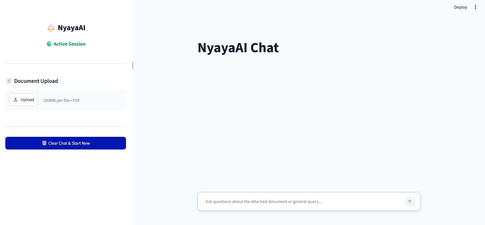
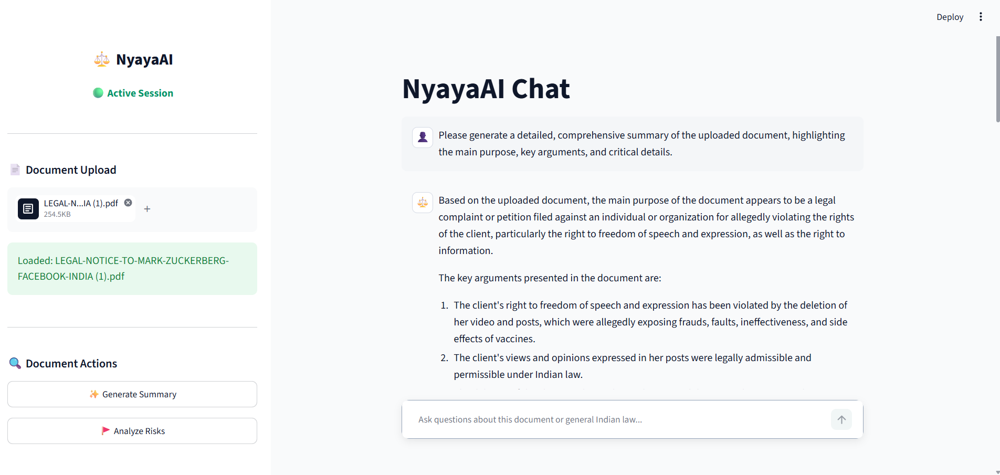
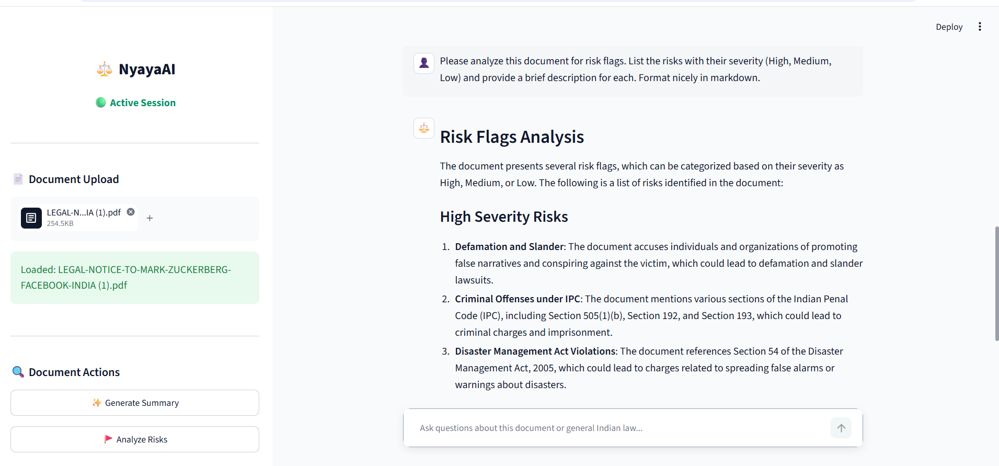
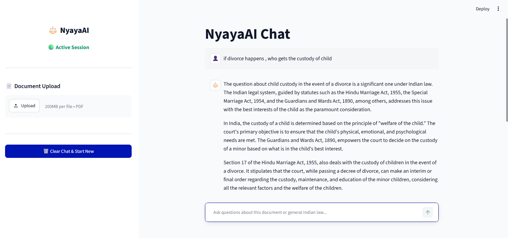

# ⚖️ NyayaAI - Advanced Indian Legal Assistant

NyayaAI is an intelligent, RAG-powered legal assistant tailored specifically for Indian Jurisprudence. It acts as an interactive workspace where users can upload legal documents (like leases, contracts, and notices) for instant analysis or query general legal concepts relating to the Indian Constitution, the Indian Penal Code (IPC), and Bharatiya Nyaya Sanhita (BNS).

## ✨ Key Features

*   **Deep Legal Knowledge:** Trained to understand and advise on Indian law, procedures, penal codes, and next steps for legal cases.
*   **Instant Document Analysis (RAG):** Drag and drop your PDF legal documents into the workspace. NyayaAI automatically processes them and extracts:
    *   🚩 **Risk Flags:** Identifies potential legal risks or loopholes and highlights their severity.
    *   ✨ **AI Summary:** Generates a concise, easy-to-understand summary of the document's main purpose.
*   **Interactive Chat:** Ask specific questions about the uploaded document or general legal questions. NyayaAI will use the document context combined with its internal legal knowledge to provide accurate answers.
*   **Modern Light UI:** A sleek, clean, and professional dashboard designed natively in Streamlit to mimic premium legal workspaces.

## 📸 App Screenshots
*(To view these on GitHub, save your screenshots to an `assets/` folder in this directory and name them accordingly!)*

| Empty Chat State | Document Summary |
| :---: | :---: |
|  |  |

| Risk Analysis | General Query |
| :---: | :---: |
|  |  |

## 🛠️ Tech Stack

*   **Frontend / UI:** [Streamlit](https://streamlit.io/) with a customized native light theme (`.streamlit/config.toml`).
*   **LLM Provider:** [Groq](https://groq.com/) for lightning-fast inference.
*   **Models Used:** `llama-3.3-70b-versatile` (Primary Legal Engine).
*   **Framework:** [LangChain](https://www.langchain.com/) (Orchestration, document loading, and prompt management).
*   **Vector Database:** FAISS (Facebook AI Similarity Search) for fast, local semantic search.
*   **Embeddings:** `sentence-transformers/all-MiniLM-L6-v2` via HuggingFace.
*   **Document Parsing:** `PDFPlumberLoader` for highly accurate PDF text extraction.

## 🚀 Setup Instructions

1.  **Clone the Repository** and navigate to the project folder.
2.  **Create & Activate a Virtual Environment:**
    ```bash
    python -m venv venv
    
    # On Windows:
    venv\Scripts\activate
    
    # On Mac/Linux:
    source venv/bin/activate
    ```
3.  **Install Requirements:**
    ```bash
    pip install -r requirements.txt
    pip install torchvision # Required dependency for HuggingFace embeddings
    ```
4.  **Set up your API Key:**
    *   Get a free API key from the [Groq Console](https://console.groq.com/keys).
    *   Create a `.env` file in the root directory.
    *   Add your key like this: `GROQ_API_KEY=your_api_key_here`
5.  **Run the Application:**
    ```bash
    streamlit run frontend.py
    ```

## ⚠️ Disclaimer
*NyayaAI is an AI tool designed purely for educational and preliminary legal research purposes. It does not replace professional legal counsel. Always consult with a qualified attorney for serious legal matters.*
